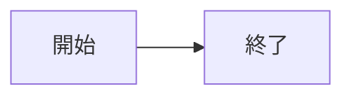

# Resource形式と変換契約 v0.2

状態: **提案。永続形式の実装前にADR-0002を承認する。**
「格納場所の切替」と「画像へのexport」は別operationである。

## 1. 正本

PNG／SVGは元bytes、Mermaidはソース、draw.ioはXMLが正本。GUI編集を伴わないstorage変換で図データを正規化・再描画・再圧縮しない。GUI編集や明示exportはbytes一致ではなく意味とmetadata保持を検証する。

## 2. 記法

### PNG／SVG

外部は通常Markdown画像。内蔵はdata URIを使う。他viewerがdata URIを許可することまでは保証しない。

```markdown


```

PNG／SVGのdraw.io編集metadataは保存bytesから検出する。`.drawio.svg`という名前だけで信頼しない。sanitizeされた表示コピーで元bytesを上書きしない。

### Mermaid内蔵

````markdown

````

### draw.io内蔵

````markdown
```drawio
<mxfile><diagram id="example">...</diagram></mxfile>
```
````

上のXMLは記法説明用の省略例で、実装試験用の有効diagram fixtureではない。

### 外部の図ソース

```markdown
[処理フローのソース](./設計.assets/flow.mmd)
<!-- mdw-resource:{"v":1,"id":"flow-1","kind":"mermaid"} -->

[構成図のソース](./設計.assets/system.drawio)
<!-- mdw-resource:{"v":1,"id":"system-1","kind":"drawio"} -->
```

markerは**直前の独立したリンク段落1個**にだけ結び付く。sourceパスの正本はリンクtargetとし、metadataに二重保存しない。既存HTMLコメントを一般的に実行する機能は設けない。他viewerでは図が表示されない場合でもsourceリンクが残る。

`v`はintegerで1のみ、`kind`はmermaid／drawio、`id`は文書内uniqueな非秘密ID。生成時はUUIDを推奨する。未知version、重複key、不正JSON、巨大metadata、曖昧な直前ブロックは不活性の原文として残す。将来の未知fieldは削除せず保持する。JSON文字列中の`<`／`>`はUnicode escapeし、コメント境界を作れないようにする。

marker無しのリンクを勝手に「埋め込み図」として読むことはしない。通常のPNG／SVG画像はmarker不要。v0.1のpathだけの非表示コメントは未配布草案であり、互換形式として黙って有効にしない。

## 3. parser／編集契約

標準Markdown parserでblockとsource spanを求める。正規表現だけでnested fenceや括弧入りURLを置換しない。編集は特定revision上の最小range patchにする。コード内の最長backtickより長いfenceを選び、既存fenceが安全なら維持する。

無編集保存はraw bytesをそのまま使う。初期対応encodingはUTF-8（BOMを含む）で、元改行を保持する。変換payloadの末尾改行やBOMは黙って正規化しない。内蔵fenceへ可逆表現できない入力は、原本を残して明示変換を求める。unsupported encodingや不正UTF-8でreplacement characterを保存しない。

alt／title／リンク表記は可能な限りそのまま残す。丸括弧、日本語、スペースを含むパスはMarkdownとして正しくescapeし、backendでdecode後に認可する。

## 4. 外部化

1. 文書の保存先と対象resourceを確定。未保存文書は先にSave Asする。
2. source revision、文書disk hash、外部source hashを取得する。
3. デフォルト保存先は`<文書stem>.assets/`、名前衝突時はsuffix追加。上書きは個別承認が必要。
4. ローカルの許可root内へ解決する。absolute、UNC、symlink先、junction先が外なら再承認する。
5. 元データを検証し、文書と資産のtransactionを作る。
6. 出力bytesのhashを検証してから文書linkへ切替。変換前snapshotを保つ。

## 5. 内蔵化

許可済みローカルファイルを読み、実サイズ・MIME・内容を検証する。source textまたはdata URIを生成し、同じtransactionで文書のみ更新する。元外部ファイルは残す。remote URLは自動downloadせず別操作として明示許可する。

## 6. journalと障害回復

journalはアプリprivate storageへ保存し、transaction ID、元／新文書hash、asset hash、保存先、stage、作成済み／既存assetを持つ。秘密情報や任意source全文をlogへ複製しない。必要なsnapshotはprivate領域で保持期間を制御する。

| 中断位置 | 再起動時の扱い |
|---|---|
| PREPARED以前 | 原文・外部ファイルは不変 |
| temp資産のみ作成 | hashと所有transactionを確認して復旧候補にする |
| ASSET_DURABLE、文書未更新 | 新資産を残し、原文を開く。再試行／orphan整理を案内 |
| 文書replace直後、stage未更新 | 文書hashが新hashならcommit済みとしてjournalを進める |
| expected hashと実ファイルが不一致 | 自動rollback／overwriteせずRecoveryRequiredへ |
| 複数資産の一部のみ完成 | 文書をcommitしない。完成済み資産と未完了分をjournalで区別 |

atomic replaceは同一filesystem内の単一file operationに限る。Windowsのロック、権限不足、disk full、ネットワークFSで保証が違うことを検出する。v1の保証範囲はローカルFSとして明記し、クラウド同期folderでは追加競合試験を要する。

## 7. Undo・共有参照

文書内の切替Undoは参照表現を戻すが、作った外部ファイルを自動削除しない。図GUIによる外部資産更新のUndoは、資産hashがその操作後から変わっていないときだけ復元候補を作る。他アプリ・別文書による更新があれば確認する。

現在の文書で複数箇所から同じ資産を参照していれば影響箇所を表示する。ディスク全体を無断scanして「全参照を把握した」と主張しない。

## 8. 必須の往復検証

変換のみ: `external → embedded → external`でSHA-256一致。PNG／SVGの編集metadata一致、XML／Mermaidの日本語・コメント・改行保持を確認する。GUI編集後: 出力を元editorへ再loadし、図形・接続・page構造を確認する。render画像の一致だけで編集可能性を判定しない。
